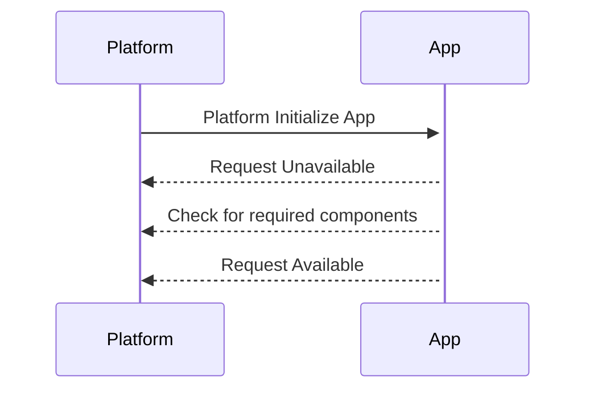
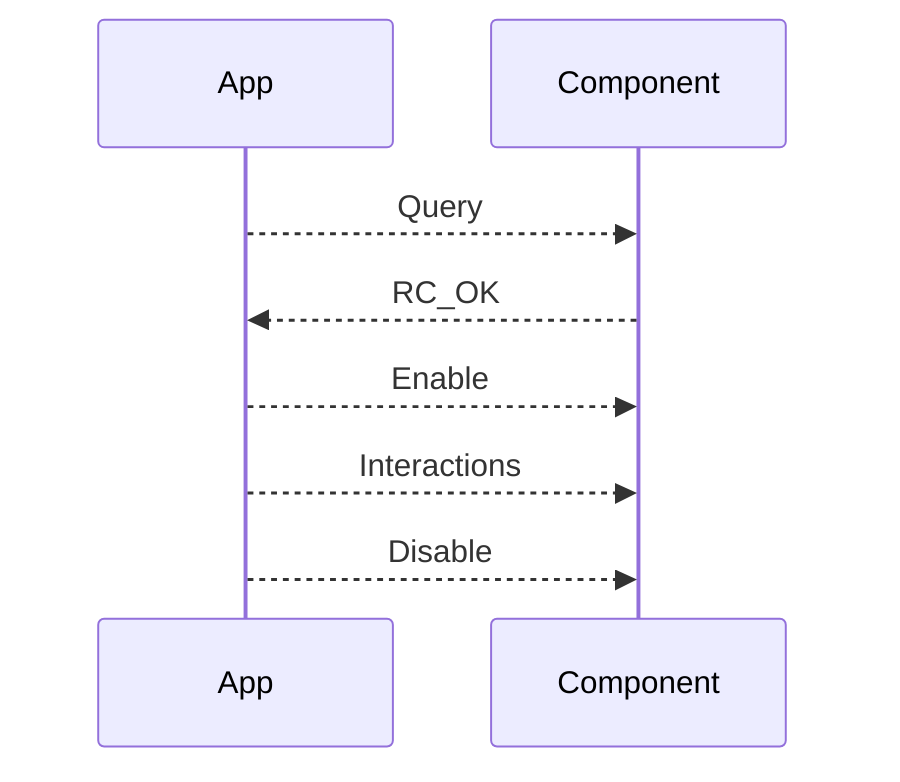

# @elevated-libs/cuss2

## About Elevated CUSS Library

Interact with a CUSS 2 API using a simple interface leveraging the asyncronicity of event driven architectures. By using the Elevated CUSS library you will get:

  - Simple device interfaces
  - Subscribable events for all CUSS states and device status
  

CUSS [(Common Use Self-Service)](https://www.iata.org/en/programs/passenger/common-use/#tab-2) is a modern Typescript library facilitating application development of Self-Service check-in apps, self-tagging apps and self bag-drop apps.

You can have CUSS 2 NOW and run a modern browser entirely without plugins or Java. Finally, your Information Security department will be able to sign off on your CUSS applications.  

We have also created typescript angular and react libs facilitating rapid development of CUSS applications.  

The library and corresponding app platform also ensure backwards compatibility to legacy 1.X versions of CUSS.

- Typescript libs for [Angular](https://github.com/elevationsoftware/cuss2-docs/blob/master/angular/README.md) and [React](https://github.com/elevationsoftware/cuss2-docs/blob/master/react/README.md)


## The Sandbox

While you are developing your application, you can use the Elevated CUSS Sandbox to test against real platform responses. Watch your application respond correctly to CUSS Events like a paper jam or a required device unavailable.
- [CUSS Sandbox](https://elevated-admin.herokuapp.com/login?org=cuss)

## Getting Started

1. Request an access token from the Elevation Software Team.  
  
2. Generate an `.npmrc` file and add the token to this file.

To install the lib run:

```sh
npm install @elevated-libs/cuss2
```

To begin using the library, you will need to import the library into your project and set up a connection.

```ts
import { Cuss2 } from "@elevated-libs/cuss2";

const serviceState: { cuss2: Cuss2 | any} = { ref: null };
const connect = async (cuss2URL: string, clientId: string, clientSecret: string): Promise<Cuss2 | null> => {
    // Avoid multiple subscriptions
    if (serviceState.ref) {
        return serviceState.ref;
    }
    const cuss2 = await Cuss2.connect(cuss2URL, clientId, clientSecret);
    serviceState.cuss2 = cuss2;
    return ref;
};

// Connect to cuss2 Platform
const { clientId, clientSecret, platformURL } = platformConfig;
connect(platformURL, clientId, clientSecret)
  .then(checkDevices)
  .catch(connectionFailure);
```

## State Transitions

One of the most important aspect in a CUSS platform, is the ability to transition between application states correctly, that is why we tried to simplify all different aspect of the transitions through a simple rxjs subscription.



```ts
// CUSS Transitions

// Instantiating a connection
const cuss2 = await Cuss2.connect(cuss2URL, clientId, clientSecret);

// Moving to unavailable
await cuss2.requestUnavailableState();

// checking for a ATB Printer
if (cuss2?.boardingPassPrinter) {
  // Moving to Available
  await cuss2.requestAvailableState();
}

// Subscribe to active state
cuss2.activated.subscribe(() => {
  console.log('Application is active');
});

// Subscribe when application goes from active to available
cuss2.deactivated.subscribe(() => {
  console.log('Application is not longer active');
});

```

### Interacting with CUSS Devices
The library provides a simple and intuitive interface to interact with common CUSS devices, that enable developer to develop complex platform interactions without any unnecessary boilerplate.



#### MediaOutputs

```ts
const cuss2 = await Cuss2.connect(cuss2URL, clientId, clientSecret);

// query ATB
 const res: PlatformData = await cuss2?.boardingPassPrinter.query();

 // validate component state
 if (res.meta.componentState !== ComponentState.READY) {
    console.log('Component is not ready')
 } else {

  // Enable component
  await cuss2.boardingPassPrinter.enable();

  // SETUP ATB
  await cuss2.boardingPassPrinter.setup(<PECTAB>);

  // Print boarding pass
  await cuss2.boardingPassPrinter.send(<PECTAB>);

  // Helper function to do both setup and send
  await cuss2.boardingPassPrinter.setupAndPrintRaw([<PECTAB_ARRAY>], <STREAM>);

  // Disable component
  await cuss2.boardingPassPrinter.disable();
 }

```

#### MediaInput

```ts
const cuss2 = await Cuss2.connect(cuss2URL, clientId, clientSecret);

// query component
 const res: PlatformData = await cuss2?.barcodeReader.query();

 // validate component state
 if (res.meta.componentState !== ComponentState.READY) {
    console.log('Component is not ready')
 } else {
  // Enable component
  await cuss2.barcodeReader.enable();

  // Subscribe to MEDIA_PRESENT
  cuss2.barcodeReader.data.asObservable().subscribe((data: DataRecordList) => {
    console.log(`Barcode Data ${data}`);

    // Disable component
    await cuss2.barcodeReader.disable();
  });
 }

```

### Methods and Components
Below are the methods you can use to interact with the CUSS 2.0 API and a list of components. 
___

| Method                                              | Description                                                                                                   |
| --------------------------------------------------- | ------------------------------------------------------------------------------------------------------------- |
| announcement(componentID, rawData)                  |<table><thead><tr><th>Method</th><th>Description</th></tr></thead><tbody><tr><td>play(componentID, rawData)</td><td>Play the announcement</td></tr><tr><td>pause(componentID)</td><td>Pause the announcement</td></tr><tr><td>resume(componentID)</td><td>Resume the announcement</td></tr><tr><td>stop(componentID)</td><td>Stop the announcement</td></tr></tbody></table>|                     
| cancel(componentID)                                 | Sends a cancel command to a given component (device).                                                         |                              
| checkRequiredComponentsAndSyncState()               | Check if all required components are available and move application to the appropriate state based on status. |                        
| connect(url, client_id, client_secret, options opt) | Connect to the cuss platform.                                                                                 |               
| disable(componentID)                                | Sends disable command to a given component (device).                                                          |         
| enable(componentID)                                 | Sends enable command to a given component (device).                                                           |         
| getComponents()                                     | Get a list of components.                                                                                     |         
| getEnvironment()                                    | Get the current environment level.                                                                            |         
| getStatus(componentID)                              | Get the status of a given component (device).                                                                 |         
| queryComponents()                                   | Query each component for its current state.                                                                   |         
| requestActiveState()                                | Request the platform to change the application state to Active state.                                         |         
| requestReload()                                     | Request the platform to reload the application.                                                               |         
| setup(componentID, dataExchange)                    | Send setup instructions to a given component (device).                                                        |
| staterequest(state, reasonCode, reason)             | Sends request to the platform for the application to change states.                                           |
| authorize(url, client_id, client_secret, timeout)   | Retrieve a token from the CUSS Oauth Server using a client id and client secret.                              |
| connect(baseURL, client_id, client_secret, tokenURL)| Connects to a CUSS Platform at the provided URL.                                                              |
___

| Components          | Description                                       |
| ------------------- | ------------------------------------------------- |
| Announcement        | A component that announces messages.              |
| BagTagPrinter       | A component that prints bag tags.                 |
| BarcodeReader       | A component that reads barcodes.                  |
| BoardingPassPrinter | A component that prints boarding passes.          |
| CardReader          | A component that reads cards.                     |
| Dispenser           | A part of a printer that dispenses printed media. |
| DocumentReader      | A component that reads documents.                 |
| Feeder              | A part of a printer that feeds paper.             |
| Headset             | A component that provides audio feedback.         |
| Illumination        | A component that controls illumination.           |
| Keypad              | A component that provides keypad input.           |

#### Card Reader

Besides inheriting from all the Media Input methods, the library provides an automatic way to setup a card reader component to read ISO track data without truncation. This feature is only available on Platforms data provide a card reader component interface on CUSS 2 Platforms. The magtripe capabilities are officcially removed from CUSS 2 specification.

```ts
const cuss2 = await Cuss2.connect(cuss2URL, clientId, clientSecret);

// query component
 const res: PlatformData = await cuss2?.cardReader.query();

 // validate component state
 if (res.meta.componentState !== ComponentState.READY) {
    console.log('Component is not ready')
 } else {
  // Enable component for ISO track data, for 10 secs then automatically disable the device
  await cuss2.cardReader.readPayment(5000);

  // Subscribe to MEDIA_PRESENT
  cuss2.cardReader.data.asObservable().subscribe((data: DataRecordList) => {
    console.log(`card Reader Data ${data}`);
  });
 }

```